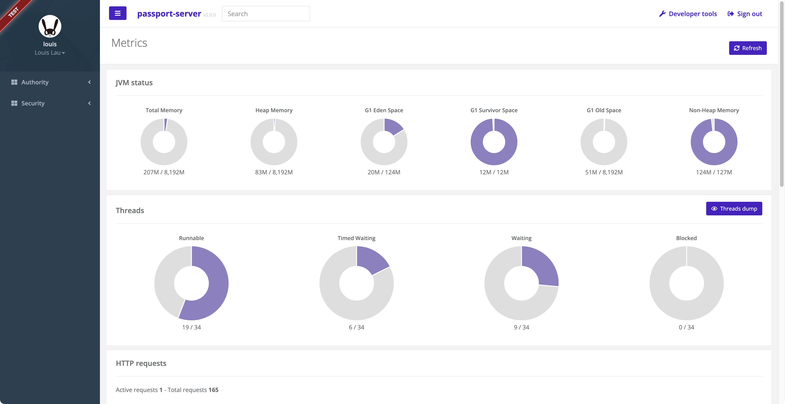

= LUI️✘ Passport

[[index]]
== Index

* <<website, Official website>>
* <<repository, Code repository>>
* <<requirements, Requirements>>
* <<dependencies, Dependencies>>
* <<build, Build>>
* <<run, Run>>
* <<running-the-test-cases, Running the test cases>>
* <<snapshots, Snapshots>>
* <<contacts, Contacts>>
* <<references, References>>

[[website]]
== Official website
http://www.luixtech.com

[[repository]]
== Code repository
https://github.com/pm6422/passport

[[overview]]
== Overview
This project provides you a standard auth2 server which is based on https://spring.io/projects/spring-authorization-server[spring-authorization-server] and client configuration powered by Spring Boot 2 with the ability to authenticate login and using MySQL DB as datastore.
It demonstrates Authorization Server with the `authorization_code` and `client_credentials` grant types. This authorization server is configured to generate JWT tokens signed with the `RS256` algorithm.

[[requirements]]
== Requirements
Before you can build this project, you must install JDK on your machine. You can install JDK by https://sdkman.io/install[SDK Man]. e.g.
```bash
sdk install java 18-zulu
```
NOTE: Java compatability: JDK 9 ~ 18

This project needs a MySQL database as the backend storage. e.g. to start a MySQL database in a docker container, run:

```bash
docker-compose -f passport-server/src/main/docker/mysql.yml up -d
```

[[dependencies]]
== Dependencies
- spring-boot 2.7.1
- spring-security-oauth2-authorization-server 0.3.1
- AngularJS 1.5.0

[[build]]
== Build

Run the following command to build the project:

```
./mvnw clean verify
```

[[run]]
== Run
This project contains two sub-modules, the server-side (passport-server) and the client-side (passport-client). The application will automatically execute DDL and DML SQL to initialize the database during the first startup.

Run LUI️✘ passport server:

```bash
java -jar passport-server/target/*.war
```

Then navigate to http://localhost:9010[http://localhost:9010] in your browser.

Run LUI️✘ passport client:

```bash
java -jar passport-client/target/*.war
```

Then navigate to http://localhost:9020[http://localhost:9020] in your browser.


[[running-the-test-cases]]
== Running the test cases

Import the project into your IDE and run `OAuth2OAuth2AuthorizationIT` test case.

=== What is it doing?

The tests are making requests to the token endpoint with the `client_credentials`, `password`,`refresh_token`,`authorization_code` grant types.

[[snapshots]]
== Snapshots




[[contacts]]
== Contacts
- WeChat ID: pm6422
- Email: louis@luixtech.com

[[references]]
== References
https://www.ruanyifeng.com/blog/2019/04/oauth-grant-types.html[OAuth 2.0 的四种方式]

https://spring.io/projects/spring-security-oauth[End-of-Life for Spring Security OAuth]