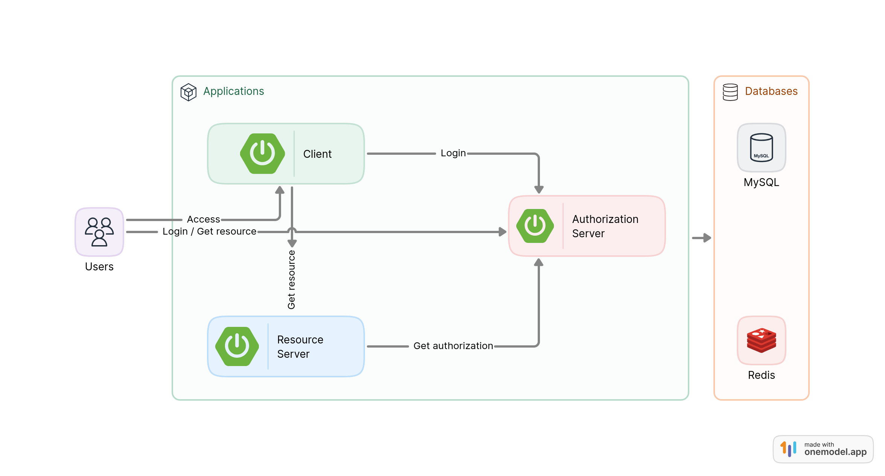

= Luix Passport

This project provides you a standard authorization server based on https://datatracker.ietf.org/doc/html/draft-ietf-oauth-v2-1-07#section-1.1[OAuth 2.1 Authorization Server], resource server and client configuration powered by Spring Authorization Server and Spring Boot 3 with the ability to authenticate traditional login and social login.

Supported social login:

- Google
- GitHub

[[website]]
== Official website
https://passport.luixtech.cn

[[repository]]
== Code repository
https://github.com/pm6422/luix-passport

[[snapshots]]
== Snapshots
image::images/demo.gif[]

[[requirements]]
== Requirements
Prior to building this project, it is necessary to install the JDK on your machine. The JDK can be installed using https://sdkman.io/install[SDK Man].

```bash
sdk install java 21.0.1-amzn
```
NOTE: Java compatability: Java 21 above

[[tech-stack]]
== Tech Stack
- Java 21
- Spring Boot 3.2.0
- Spring Security OAuth2 Authorization Server 1.1.0
- PostgresSQL 16

[[UsingDocker]]
== Using Docker
Install docker to simplify development, run:
```
curl -fsSL https://get.docker.com | bash -s docker --mirror Aliyun
```

[[nodejs]]
== Using NodeJS
Install NodeJS to simplify local development, run:
```
apt install nodejs npm -y
```

[[app_arch]]
== Application Architecture


[[run-demo-sample]]
== Run multiple applications locally in two steps
=== 1. Build application docker images
* Run the command under the project root directory
```bash
npm run docker:build
```
* Or run the below command if using ARM CPU
```bash
npm run docker:build:arm64
```

=== 2. Run all the middleware and applications
* Run authorization server, resource server, client, and initialize database in one command
```bash
npm run all:up
```

[[access_app]]
== Application URLs
* Navigate to `http://127.0.0.1:4001` to access authorization server
* Navigate to `http://127.0.0.1:4002` to access resource server
* Navigate to `http://127.0.0.1:4003` to access client

|===
|Username |Password |Roles

|user
|user
|user

|admin
|admin
|user,admin

|===


[[scope_permission]]
== Client Scope vs. UserPermission
[cols="1,1,1", options="header"]
|===
| Aspect         | Scope (OAuth2)                | Permission (RBAC)
| **Purpose**    | Controls what _client apps_ can access (API/resources) | Controls what _users_ can do within the system
| **Managed By** | Authorization Server (e.g., Keycloak, Auth0) | Business Application (e.g., Spring Security + DB)
| **Storage**    | In JWT's `scope` claim         | In database `permission` table
| **Format**     | Typically `resource:action` (e.g., `api:read`) | Often `entity:operation` (e.g., `user:delete`)
| **Example**    | `orders:write` (Client can modify orders) | `report:export` (User can export reports)
| **Transformed in Spring Security** | Becomes `SCOPE_` + scope (e.g., `SCOPE_orders:write`) | Used directly as `Authority` (e.g., `report:export`)
| **Use Case**   | External apps accessing APIs (e.g., mobile app with `read:profile`) | Internal user role permissions (e.g., admin can `user:delete`)
|===

[[configuring-social-login]]
== Configuring Social Login

The demo sample may be configured to provide social login capability.

[[google-login]]
==== Login with Google

This section shows how to configure Google as a social login provider.

[[google-initial-setup]]
===== Initial setup

To use Google's OAuth 2.0 authentication system for login, you must set up a project in the Google API Console to obtain OAuth 2.0 credentials.

NOTE: https://developers.google.com/identity/protocols/OpenIDConnect[Google's OAuth 2.0 implementation] for authentication conforms to the
https://openid.net/connect/[OpenID Connect 1.0] specification and is https://openid.net/certification/[OpenID Certified].

Follow the instructions on the https://developers.google.com/identity/protocols/OpenIDConnect[OpenID Connect] page, starting in the section, "Setting up OAuth 2.0".

After completing the "Obtain OAuth 2.0 credentials" instructions, you should have a new OAuth Client with credentials consisting of a Client ID and a Client Secret.

[[google-redirect-uri]]
===== Setting the redirect URI

The redirect URI is the path in the application that the end-user's user-agent is redirected back to after they have authenticated with Google
and have granted access to the OAuth Client _(created in the previous step)_ on the Consent page.

In the "Set a redirect URI" sub-section, ensure that the *Authorized redirect URIs* field is set to `http://localhost:4001/login/oauth2/code/google-idp`.

TIP: The default redirect URI template is `{baseUrl}/login/oauth2/code/{registrationId}`.
The *_registrationId_* is a unique identifier for the `ClientRegistration`.

[[google-application-config]]
===== Configure application.yml

Now that you have a new OAuth Client with Google, you need to configure the application to use the OAuth Client for the _authentication flow_. To do so:

. Go to `application.yml` and set the following configuration:
+
[source,yaml]
----
spring:
  security:
    oauth2:
      client:
        registration:	<1>
          google-idp:	<2>
            provider: google
            client-id: google-client-id
            client-secret: google-client-secret
----
+
.OAuth Client properties
====
<1> `spring.security.oauth2.client.registration` is the base property prefix for OAuth Client properties.
<2> Following the base property prefix is the ID for the `ClientRegistration`, such as google-idp.
====

. Replace the values in the `client-id` and `client-secret` property with the OAuth 2.0 credentials you created earlier.
Alternatively, you can set the following environment variables in the Spring Boot application:
* `GOOGLE_CLIENT_ID`
* `GOOGLE_CLIENT_SECRET`

[[github-login]]
==== Login with GitHub

This section shows how to configure GitHub as a social login provider.

[[github-register-application]]
===== Register OAuth application

To use GitHub's OAuth 2.0 authentication system for login, you must https://github.com/settings/applications/new[Register a new OAuth application].

When registering the OAuth application, ensure the *Authorization callback URL* is set to `http://localhost:4001/login/oauth2/code/github-idp`.

The Authorization callback URL (redirect URI) is the path in the application that the end-user's user-agent is redirected back to after they have authenticated with GitHub
and have granted access to the OAuth application on the _Authorize application_ page.

TIP: The default redirect URI template is `{baseUrl}/login/oauth2/code/{registrationId}`.
The *_registrationId_* is a unique identifier for the `ClientRegistration`.

[[github-application-config]]
===== Configure application.yml

Now that you have a new OAuth application with GitHub, you need to configure the application to use the OAuth application for the _authentication flow_. To do so:

. Go to `application.yml` and set the following configuration:
+
[source,yaml]
----
spring:
  security:
    oauth2:
      client:
        registration:	<1>
          github-idp:	<2>
            provider: github
            client-id: github-client-id
            client-secret: github-client-secret
----
+
.OAuth Client properties
====
<1> `spring.security.oauth2.client.registration` is the base property prefix for OAuth Client properties.
<2> Following the base property prefix is the ID for the `ClientRegistration`, such as github-idp.
====

. Replace the values in the `client-id` and `client-secret` property with the OAuth 2.0 credentials you created earlier.
Alternatively, you can set the following environment variables in the Spring Boot application:
* `GITHUB_CLIENT_ID`
* `GITHUB_CLIENT_SECRET`

[[Knowledge]]
== Knowledge
=== Authentication Methods
1. Cookie-based Authentication:
- Involves creating a session ID for each user after they have successfully authenticated with their username and password. The session ID is then stored on the server and sent to the client as a cookie. Suitable for web-based authentication but not for mobile-based authentication. The server uses the session ID to track the user's entire session. The session ID is stored in a cookie on the client-side and sent to the server with each request. Cookies can be shared across subdomains by modifying the cookie's domain to the parent domain.
- Cookies can be vulnerable to attacks, so it's important to set SameSite, HttpOnly, and Secure attributes to prevent unauthorized access.

2. Token-based Authentication:
- Involves issuing a token to a user after they have authenticated with their username and password. The token is then sent to the client and included in subsequent requests as an HTTP header. The server validates the token to identify the user. Token-based authentication is advantageous because it eliminates the need for server-side session data storage, which can improve scalability.
- However, token-based authentication has some security risks, such as the potential for token theft.

3. JWT Authentication:
- A type of token-based authentication that uses JSON Web Tokens (JWTs) as the access token. JWTs are a secure and self-contained way of transmitting information between parties in a compact format. JWTs are widely used for stateless authentication and authorization, and they offer several advantages, such as scalability, flexibility, and standardization.
- However, JWT authentication has some security risks, such as the potential for token theft.

4. Open Authorization (OAuth) Authentication:
- An open standard for authorization that allows users to grant third-party applications access to their resources without sharing their credentials. OAuth works by issuing access tokens to third-party applications, which are then used to access the user's resources. OAuth is widely used for social login and is advantageous because it allows users to share their resources with third-party applications without exposing their credentials.
- However, OAuth also has some security risks, such as the potential for token theft and the need to properly secure the authentication process.

5. Security Access Markup Language (SAML) Authentication:
- An open standard that encodes text into machine language and enables the exchange of identification information. It has become one of the core standards for SSO and is used to help application providers ensure their authentication requests are appropriate. SAML 2.0 is specifically optimized for use in web applications, which enables information to be transmitted through a web browser.

6. OpenID Connect (OIDC) Authentication:
- Sits on top of OAuth 2.0 to add information about the user and enable the SSO process. It allows one login session to be used across multiple applications. For example, it enables a user to log in to a service using their Facebook or Google account rather than entering user credentials.

=== Single Sign-on (SSO)
- A method that allows users to use a single set of login credentials to access multiple applications or services. With SSO, the user only needs to authenticate once, and the authentication is then propagated to all other services that are part of the SSO network. SSO is advantageous because it reduces the number of passwords that users need to remember and simplifies the authentication process.
- However, SSO also has some security risks, such as the potential for a single point of failure and the need to properly secure the authentication process.

=== Types of SSO
- OAuth Authentication
- SAML
- OIDC

[[critical_classes]]
== OAuth Server Critical Classes
- org.springframework.security.oauth2.server.authorization.oidc.web.OidcLogoutEndpointFilter.doFilterInternal()
- org.springframework.security.oauth2.server.authorization.oidc.web.authentication.OidcLogoutAuthenticationConverter.convert()
- org.springframework.security.oauth2.server.authorization.oidc.authentication.OidcLogoutAuthenticationProvider.authenticate()

[[references]]
== References
https://www.toutiao.com/article/6848835275460706827/[如何设计一个通用的权限管理系统]

https://www.toutiao.com/article/6926543668228735500/[一文搞定spring权限认证表设计]

https://docs.spring.io/spring-security/reference/index.html[Spring Security Reference]

https://oauth.net/code/java/[OAuth Libraries for Java]

https://zhuanlan.zhihu.com/p/441831786[spring boot 2.x 中使用oauth2趟坑记录]

https://idontwannarock.github.io/spring-security-reference/docs/1_gett_star/[Spring Security 之不要太相信這個中文手冊]

[[thanks]]
== Thanks
Thanks for the license provided by JetBrains

image::https://images.gitee.com/uploads/images/2020/0406/220236_f5275c90_5531506.png[]
